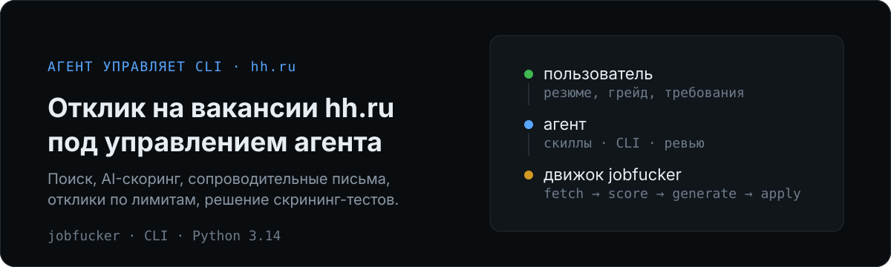
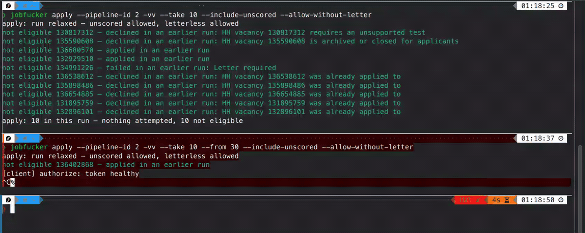
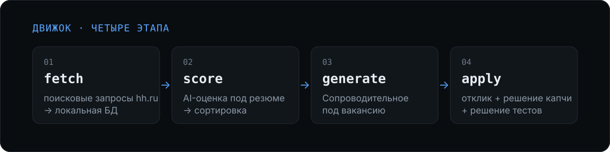

# jobfucker

<p align="center">
  
</p>

Автоматизация отклика на вакансии hh.ru (и другие сервисы в будущем).


> Ранняя альфа. Пока только CLI; GUI запланирован.

## Демо



Реальный прогон `jobfucker apply`: отклики, обработка ошибок и вывод результатов.

## Что это

Проект **не рассчитан на прямое использование человеком.** CLI сложный, UX не для ручной
работы. Работать рекомендуется через ИИ-агента: агент читает скиллы, дёргает CLI, читает дампы
и правит промпты. Человек принимает решения (требования, грейд, лимиты, капча).

## Как это работает

Заняты **два ИИ** с разными ролями:

1. **Агент** — управляет CLI, используя скиллы (`skills/`). `codex`, `claude code` и тд.
   Рекомендуемый бесплатный вариант: [opencode](https://opencode.ai/).
2. **OpenAI-совместимый API** внутри проекта — скоринг, сопроводительные, решение тестов,
   распознавание капчи. Рекомендуемые бесплатные варианты: free модели с
   [OpenRouter](https://openrouter.ai/collections/free-models) или
   [Kilo](https://kilo.ai/landing/free-models).

<p align="center">
  
</p>

Встроенный ИИ проекта делает потоковые операции (score / generate / tests / captcha).
Сложные процессы ведёт агент.

Типовой цикл:

```
setup → fetch → score → ревью и итерация промпта → triage requires_attention → generate → apply → status
```

Самое сложное — в начале итеративно настроить фетчинг и фильтрацию вакансий. Этапы CV и apply дальше
работают по накатанной.

## Быстрый старт

**Рекомендуется: попросите вашего ИИ-агента всё настроить.** Скопируйте промпт:

```
Помоги мне установить и разобраться с автокликером вакансий jobfucker
https://github.com/stone-w4tch3r/jobfucker
Установи зависимости и помоги настроить pipeline, используя скиллы репозитория в папке skills/.
```

Запустите своего агента в этой папке и попросите начать скилл `jobfucker-setup`:

```bash
opencode # codex, claude или любой другой агент
```

<details>
<summary>Установка вручную</summary>

```bash
# Установите `uv` (см. https://docs.astral.sh/uv/):
curl -LsSf https://astral.sh/uv/install.sh | sh
# Windows:
# powershell -c "irm https://astral.sh/uv/install.ps1 | iex"

git clone https://github.com/stone-w4tch3r/jobfucker.git
cd jobfucker
uv sync
uv tool install --force --editable .   # ставит команду `jobfucker` глобально (иначе — `uv run jobfucker`)
```

Чтобы настроить самому — прочитайте скиллы в `skills/`.

Дальше: `jobfucker init --config <file>` → `fetch` → `score` → `generate` → `apply`.

</details>

## Скиллы — операционное руководство

Агент подхватывает скиллы сам; человеку их читать не обязательно.

| Скилл | Про что |
| --- | --- |
| `jobfucker-setup` | первичная настройка: установка, конфиг, HH-доступ, AI, капча, первый запуск |
| `jobfucker-workflow` | операционный цикл: fetch → score → ревью → generate → apply, triage, лимиты |
| `jobfucker-creating-prompts` | скоринг-промпт и сопроводительное (спрашивает предпочтения) |
| `jobfucker-collecting-hh-vacancies` | подбор и проверка поисковых запросов HH |

## Требования

- Python 3.14+ и `uv`
- Аккаунт hh.ru и резюме
- OpenAI-совместимый AI-провайдер (текстовая модель + vision для капчи)
- ИИ-агент (Claude Code, Kilo и т. п.)

## Документация

- **`AGENTS.md`** — входная точка для агента и разработчика: подсистемы, команды, архитектура,
  верификация. Все технические подробности — там.
- `docs/` — спецификации, наблюдаемое поведение hh.ru, примеры пайплайнов и промптов.
