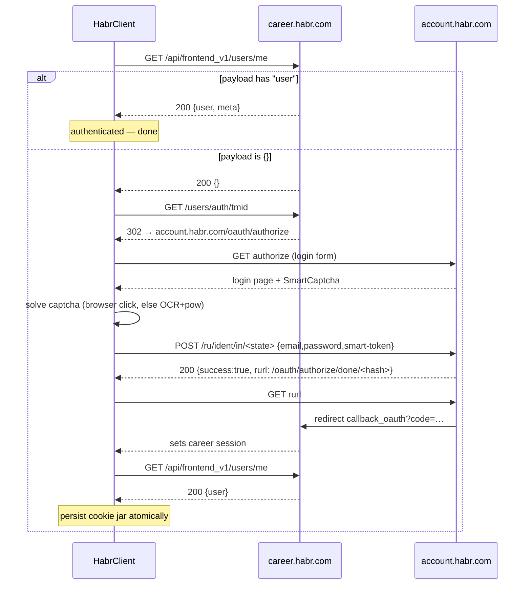

# Habr Career Client Specification

## Purpose and authority

`jobfucker.clients.habr` implements the board-neutral [Client contract](client-contract.md)
for `career.habr.com`.

Division of authority:

| Fact kind | Home |
| --- | --- |
| Observed Habr endpoints, payloads, cookies, captcha, limits | [docs/habr/](../habr/README.md) (wiki) |
| How the client uses those facts | **this file** |
| Board-neutral interface and models | [client-contract.md](client-contract.md) |
| Shared client mechanics | [architecture.md](architecture.md) |

When Habr behavior changes: update the wiki first, then this spec, then the code.

## V1 capabilities

| Capability | In V1 |
| --- | --- |
| authorize an applicant account (SSO, cookie session) | yes |
| search + fully enrich vacancies | yes |
| list-only preview (`search` / `list_vacancies`) | yes |
| list the account's resumes | yes (single resume) |
| apply to a vacancy with a letter or without | yes |
| employer screening-test solving | **no** — Habr has none observed |

Out of V1: follow-up messages, withdraw/edit-response CLI, saved searches, resume editing,
external-application forms.

---

## How Habr differs from HH

Same contract, different behavior. Read this before the rest.

| Area | HH | Habr | Why it matters |
| --- | --- | --- | --- |
| Resume count | many | **1 per account** | no resume picker, no per-vacancy resume |
| Resume id | numeric id | **account alias** | apply sends no resume param |
| Apply cap window | per day | **per month (150)** | core quota must use `apply_period="month"` |
| Apply pacing | 1–3 s | **~10 s minimum** | client-internal delay |
| Captcha | every response, PNG seam | **login only**, SmartCaptcha + PoW | board-owned login protocol |
| Screening tests | yes (`HhTestCapable`) | none | capability absent, flag stays `None` |
| Auth signal | `401` | anonymous `200 {}` | detect auth from payload, not status |
| Session kind | Bearer token + cookies | **cookies only** | persist cookie jar, no token |
| Page size | ≤100 | **≤50** | fetch geometry |
| Item cap | 2000 | **1000** | `max_search_items` |
| Over-page | short page | **`404`** | treat as exhaustion |
| Detail source | clean JSON API | **HTML with embedded JSON** | parse page |
| Filters | 8 big groups | ~7 flat fields | small filter model |

---

## Architecture

```text
HabrClient
├── HabrTransport          # endpoints, headers, CSRF, cookie jar (shared Transport core)
├── AuthCoordinator        # SSO chain, session load/refresh, identity
│   └── SessionStore       # AtomicJsonStore: cookies + identity cache
├── LoginCaptcha           # SmartCaptcha protocol: ladder, pow, spravka
│   ├── BrowserClickSolver # primary  — patchright click (shared browser)
│   └── HttpVisionSolver   # fallback — /check ladder + OCR (shared CaptchaHandler) + pow
├── SearchService          # listing JSON + detail-page enrichment
├── ResumeService          # single profile resume (alias)
└── ApplicationService     # preflight, multipart submit, pacing, reconcile
```

Rules:

- Only `HabrTransport` sends raw HTTP (over the shared `Transport`).
- Coordinators own multi-request flows and bounded replay.
- Services consume validated Habr DTOs.
- `HabrClient` maps service results into contract types.
- No screening-test module. `HhTestCapable` is **not** implemented.

### Package shape

```text
clients/habr/
├── client.py          # Client implementation + contract mapping
├── config.py          # HabrServiceConfig, HabrFilterConfig (contract), HabrSearchFilters (wire)
├── transport.py       # endpoints/headers/CSRF over the shared Transport
├── models.py          # validated Habr DTOs
├── auth.py            # SSO chain, session store, identity
├── captcha.py         # SmartCaptcha detection, ladder, pow, spravka
├── browser.py         # browser-click login solve over the shared BrowserDriver
├── search.py          # listing + detail enrichment
├── resumes.py         # single profile resume
└── applications.py    # preflight, submit, pacing, reconciliation
```

Registration touches only [clients/registry.py](../../src/jobfucker/clients/registry.py) and the
pipeline schema source — no engine, stage, storage, or CLI change.

---

## Configuration and construction

Credentials arrive through `ClientDeps` (resolved by the composition root). The client never
opens credential files.

```python
class HabrSearchType(StrEnum):
    ALL = "all"            # type=all
    SUITABLE = "suitable"  # type=suitable (board's own match; needs a session)

class HabrSearchEntry(SearchEntryBase):
    search_type: HabrSearchType = HabrSearchType.ALL
    filter: HabrFilterConfig = Field(default_factory=HabrFilterConfig)

class HabrServiceConfig(BaseModel):
    searches: tuple[HabrSearchEntry, ...] = Field(min_length=1)  # the search pool
    resume_id: str | None = None          # optional; defaults to the account alias
    captcha_max_attempts: int = Field(default=4, ge=1, le=10)
```

Notes:

- `resume_id` is **Habr-local** (not in the global section). Habr has one resume; its id is the
  account alias. Omitted → the client uses `get_identity().external_id`. If set and it does not
  match the alias → `ConfigurationError` (a pipeline stop).
- `search_type=suitable` with no session fails closed with `ConfigurationError` **before** any
  request (anonymous Habr silently ignores the flag — a silent wrong result otherwise).

### Filter contract (`HabrFilterConfig`)

Small and flat on purpose: only verified filters. UI annotations on every field.

| Field | Values | Notes |
| --- | --- | --- |
| `sort` | `relevance` \| `date` \| `salary_desc` \| `salary_asc` | default `relevance` |
| `qualification` | `intern` \| `junior` \| `middle` \| `senior` \| `lead` | maps `qid` 1/3/4/5/6 |
| `remote` | bool | `remote=true` |
| `with_salary` | bool | `with_salary=true` |
| `salary_from` | int ≥ 0 | with `salary_currency` |
| `salary_currency` | `rur` \| `eur` \| `usd` \| `uah` \| `kzt` | default `rur` |
| `skills` | tuple[int, ...] | `skills[]=<id>` |
| `locations` | tuple[str, ...] | prefixed ids `c_<id>` / `r_<id>` / `ct_<id>` |
| `employment` | `full_time` \| `part_time` | `employment_type` |

Not exposed in V1 (verified as broken or silent — see [known unknowns](../habr/known-unknowns.md)):

- `company_ids[]` — returns 0 results silently; scalar form returns `500`.
- `divisions` — silently filters nothing.

Rule: a filter that lies is worse than no filter. Add later only after verification.

### Search entry to wire

```text
HabrSearchEntry
    query ──────────────────────────────► q=
    search_type ────────────────────────► type=all|suitable
    filter.sort ────────────────────────► sort=
    filter.qualification ───────────────► qid=
    filter.remote / with_salary ────────► remote=/with_salary=
    filter.salary_from + currency ──────► salary=&currency=
    filter.skills ──────────────────────► skills[]=…
    filter.locations ───────────────────► locations[]=…
    filter.employment ──────────────────► employment_type=
    (always) ───────────────────────────► X-Requested-With: XMLHttpRequest
```

`ui_url` is built by the client from executed params (`/vacancies?q=…&type=…`); the API does not
return one.

---

## Authentication and session

Cookie-only session. No bearer token.



Rules:

- **Auth is read from the payload, never the status.** Anonymous `/users/me` is `200 {}`.
- Persist `_career_session`, `remember_user_token`, and `.habr.com` SSO cookies. Drop analytics.
- A missing `_career_session` but present `remember_user_token` → session re-issued; retry once
  before a full login.
- Persist through the shared `AtomicJsonStore` + `PersistedCookie`; per-board domain allow-list.
- CSRF token: read `meta[name=csrf-token]` from any authenticated HTML page. On `422`, refresh the
  token once and replay the single mutation once. Never loop.
- Never log credentials, cookies, CSRF tokens, or `meta.logoutToken`.
- `authorize()` is idempotent. Healthcheck through `get_identity`.
- `aclose()` closes the shared transport and the browser engine; safe to call twice.

---

## CAPTCHA

SmartCaptcha lives **only on the Habr Account login step**. Reads and apply get no captcha at
observed volume (`Server: QRATOR` is a WAF, a separate gate).

Complexity ladder (server-driven, monotonic):

```text
/check (minimal)
   ├─ status:"ok"        ─► spravka → done          (level 0 pass)
   └─ status:"failed"
        ├─ type:"checkbox" ─► escalate: /check with key + pow, no answer
        └─ type:"image"    ─► OCR text → /check with key + rep + pdata
                                └─ status:"ok" → spravka
```

`pow`: find a 16-byte nonce so `sha256(prefix ++ nonce)` has `complexity` (10) leading zero bits.
Cost is ~2^10 hashes — milliseconds.

Solve strategy — two methods, in order:

| Order | Method | When | Cost |
| --- | --- | --- | --- |
| 1 | **browser click** (`clients/habr/browser.py`) | default | no AI |
| 2 | **browserless vision** (`captcha.py`) | browser escalates or fails | one OCR call per answer |

Both reuse existing seams:
`PatchrightDriver` (shared browser) for method 1, `CaptchaHandler` (PNG → text) for the OCR step of
method 2. The ladder, `pow`, `spravka`, and `smart-token` injection are board-owned.

Escalation / fail-fast signals:

| Signal | Meaning |
| --- | --- |
| `/check` not `"ok"` | escalated |
| `smart-token` still empty after short timeout | escalated |
| `iframe[title="SmartCaptcha advanced"]` present | image challenge |

Policy:

- Session reuse is the main defense — captcha fires mainly on a fresh credential login.
- Bound OCR retries with `captcha_max_attempts`; a wrong answer returns a **fresh** image.
- Fresh image key after every answer.
- On exhaustion or an unknown `captcha.type` → `CaptchaSolvingError(recovery_url=login_url)`.
- Low volume only. Repeated failure = stop and hand to a human.

---

## Search and enrichment

### Listing surface

`GET /api/frontend/vacancies?<params>` → JSON `{list, meta}`. Anonymous works.
`X-Requested-With: XMLHttpRequest` is required for account-aware fields.

### Geometry

| Fact | Value | Client rule |
| --- | --- | --- |
| requested page size | echoed | client enforces `≤50` |
| effective page size | **50** | `page_size` capped at 50 |
| accessible positions | **~1000** | `ServiceInfo.max_search_items = 1000` |
| offset ≥ 1000 | `200` empty list | treat as **exhaustion** |
| page past `meta.totalPages` | `404 {"error":"Not found"}` | treat as **exhaustion**, not a hard error |
| short page | fewer than page_size | exhaustion |

Two exhaustion signals (`404`, empty-at-cap) must both map to exhausted. Walk runs through the
shared driver (`jobfucker.clients.paging.plan_pages` + `scan_slice` / `scan_listing`), so slice
trimming and "enrich only in-range items" hold for free.

### Enrichment

Listing items carry no description. Detail = one `GET /vacancies/<id>` per slice item. The page
embeds an inline, escaped `"vacancy":{...}` JSON with the full `description` HTML. `JobPosting`
`ld+json` is a fallback canary only.

- Enrich **only** items inside `[offset, offset + limit)`.
- `external_id`s in `exclude` → no detail `GET` at all.
- `description` HTML → normalized text via the shared `DescriptionParser`. Never regex-strip.
- Prefer the inline `vacancy` object over JSON-LD.

### Mapping

| Contract | Habr source |
| --- | --- |
| `VacancyShort.external_id` | `id` (stringified) |
| `VacancyShort.url` | `href` → absolute |
| `VacancyShort.company` | `company.title` (None when concealed) |
| `VacancyShort.area` | `locations[0].title` |
| `VacancyShort.published_at` | `publishedDate.date` (ISO) |
| `VacancyShort.snippet_*` | no board field → `None` |
| `Vacancy.description` | detail inline `vacancy.description` → plaintext |
| `Vacancy.key_skills` | `skills[].title` |
| `Vacancy.salary` | `salary.{from,to,currency}` (uppercased); `gross=False` (board does not say) |
| `Vacancy.has_hh_test` | always `None` (no Habr notion) |
| `SearchListing.found` | `meta.totalResults` |
| `SearchListing.ui_url` | built by client from params |

`predictedSalary` is a **separate** board field. Never merge it into `salary`.

`response.kind` is a listing/detail apply signal (`direct` / `applied` / `guest`). Fetch keeps it
out of stored models; the apply preflight reads it (below).

---

## Resumes

One account = one resume. The id is the account alias.

- `get_resumes()` → `Ok([ResumeInfo(resume_id=alias, title=fullName, updated_at=None)])`.
- `updated_at` is not established by Habr → `None`.
- Apply carries **no** resume parameter.
- If config `resume_id` is set and differs from the alias → `ConfigurationError` (stop).
- No published/owned resume validation (nothing to select).

---

## Applications

### Preflight

Fetch current detail before POST. Classify deterministic skips:

| Detail state | Result |
| --- | --- |
| `response.kind == "applied"` | `ApplySkipped(ApplySkip(reason="already_applied", text=…))` |
| `archived` or `hidden` | `ApplySkipped(ApplySkip(reason="vacancy_unavailable", text=…))` |
| otherwise | submit |

External-application and screening-test signals are unknown on Habr — not mapped in V1.

### Submit

```http
POST https://career.habr.com/api/frontend/vacancies/<id>/responses
X-CSRF-Token: <csrf>
Accept: application/json
Content-Type: multipart/form-data; boundary=<b>

--<b>
Content-Disposition: form-data; name="body"

<cover letter, optional>
--<b>--
```

- Letter is the multipart field `body`. Empty body applies without a letter.
- Pacing: **≥10 s between response POSTs**, monotonic clock, plus small jitter. Client-internal
  (the contract has no pacing hook).
- CSRF is required. `X-CSRF-Token` header or `authenticity_token` field.

### Outcome map

| Board signal | Contract outcome |
| --- | --- |
| `200 {"response":{"id":…}}` | `Ok(ApplySucceeded())` |
| `401 {"error":{"message":"…уже откликнулись…"}}` | `Ok(ApplySkipped(reason="already_applied", …))` |
| `401 {"error":"Войдите…"}` | `Err(AuthError)` |
| `400 {"message":"…раз в 10 секунд"}` | wait ≥10 s, retry **once**; still throttled → per-vacancy `ApplyFailed` |
| `400 {"message":"…не более 150 откликов в месяц"}` | `Err(LimitExceededError)` (stop batch) |
| `404 {"error":"Not Found"}` | `Err(NotFoundError)` |
| `422 {"status":422,…}` | refresh CSRF, retry once; still `422` → `Err(ConfigurationError)` |
| other `4xx` | `Ok(ApplyFailed(ApplyError(text=…)))` |
| `5xx` / connection loss **before** send | `Err(TransportError)` (safe to retry) |
| connection loss **after** send | reconcile, else `Err(UnknownApplyOutcomeError)` |

The two `400` bodies have the same shape; split them by message text (`"10 секунд"` vs
`"150 откликов"`). Core's own monthly counter normally stops the run first.

### Reconciliation (uncertain POST)

```text
POST failed after bytes sent
   └─ GET /vacancies/<id> detail
        ├─ response.kind == "applied" ─► ApplySucceeded
        └─ cannot establish         ─► Err(UnknownApplyOutcomeError)
```

Never auto-replay while the outcome is unknown. No HTML `/responses` scrape in V1.

### Limits

| Fact | Value | Maps to |
| --- | --- | --- |
| minimum interval | ~10 s | client pacing, not contract |
| monthly cap | 150 / account / month | `per_auth_apply_cap=150`, `apply_period="month"` |
| deletes | still count | no quota freed |
| reset boundary | unknown, accepted | core keys calendar month (UTC) |

Core counts per `(service, login, month-key)` and per pipeline. Both counters use the month window
from `ServiceInfo.apply_period`. `LimitExceededError` is authoritative and stops the batch even
below the local cap.

---

## ServiceInfo

```python
ServiceInfo(
    service="habr",
    per_auth_apply_cap=150,     # responses / month / account
    apply_period="month",       # month window, not day
    max_search_items=1000,      # accessible listing positions
)
```

---

## Error and reporting policy

Map board outcomes into the generic contract errors. Never make callers parse text.

| Signal | Error |
| --- | --- |
| connect/TLS/timeout, `5xx` on safe GET | `TransportError` |
| redirect to `/users/auth_required`, `{}` identity, login captcha error | `AuthError` |
| `404` (apply) | `NotFoundError` |
| `422` CSRF, other `400`/`422` validation | `BadRequestError` / `ConfigurationError` |
| monthly cap `400` | `LimitExceededError` |
| JSON promised but unparseable / wrong type | `ProtocolError` |
| challenge markers | `CaptchaSolvingError(recovery_url)` |
| possible Qrator interstitial / unknown `4xx` | `ProtocolError` (hand off) |

`Reporter` events: operation, page/item progress, vacancy title/URL, attempt number. Never secrets
or full payloads.

---

## Acceptance tests

Real client code against `httpx.MockTransport` (or a fixture server) + a scripted browser double.
No internal patching.

| Area | Required scenarios |
| --- | --- |
| Construction | rejects a non-Habr section; resolves credentials; closes transport/browser idempotently |
| Auth | anonymous `200 {}` → full SSO; session reuse; `remember_user_token` re-issue; identity decode; `resume_id` mismatch → `ConfigurationError` |
| Captcha | browser click pass; escalation detect; browserless OCR+pow pass; wrong answer → fresh image; exhaustion → `CaptchaSolvingError(recovery_url)`; unknown type fails |
| Transport | CSRF refresh-once on `422`; pacing; both error envelopes; malformed JSON → `ProtocolError` |
| Search | both `search_type`s; `suitable` fail-closed without session; page size `≤50`; `max_search_items=1000`; offset ≥1000 empty = exhausted; past-total `404` = exhausted; filter wire mapping; short page = exhausted |
| Enrichment | inline `vacancy` parse; escaped HTML → text; `predictedSalary` not merged; null company/salary; `exclude` skips detail GET; in-range-only enrichment |
| Resumes | single resume; alias id; `updated_at=None` |
| Apply | `200` success; duplicate `401`; anonymous `401`; throttle retry-once; monthly cap stop; `404`; CSRF refresh; letterless; letter; uncertain reconcile; unresolvable → `UnknownApplyOutcomeError` |
| Limits | month window key; shared per-auth counter; per-pipeline counter; board cap stops batch |

Live Habr smoke tests are opt-in, rate-limited, non-destructive, and use an explicit vacancy
allowlist.

---

## Non-goals (V1)

- Withdraw / edit-response CLI.
- External employer application forms.
- Screening tests (Habr has none observed; `HhTestCapable` not implemented).
- `company_ids[]` / `divisions` filters (broken upstream).
- Monthly-cap auto-reset logic (calendar key + board signal only).
- Deeper reconciliation than one detail refetch.

Reading: [docs/habr/](../habr/README.md) · [client-contract.md](client-contract.md) ·
[hh-client.md](hh-client.md)
